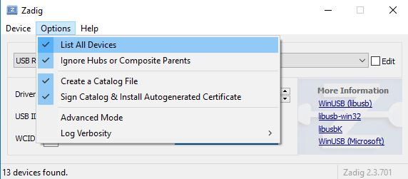
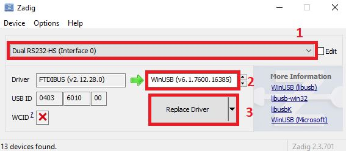

# How to setup JTAG Debugger in PIO with ESP32-C3


## Install the esptools

```console
pip install esptools
```

```console
pip install setuptools
```

##### Burn the espefuse
```console
python -m espefuse --port [your esp32 port] burn_efuse DIS_USB_JTAG 1 --do-not-confirm
```

## Setup JTAG with ESP32-C3


> You will now use the port labeled USB on the ESP-32-C3 to upload files

## Click to Download FTDI drivers

[Download](http://www.ftdichip.com/Drivers/VCP.htm)

## Click to Download Zadig

[Download](https://zadig.akeo.ie/)

## Launch Zadig

##### 1) List Devices


##### 1) Replace Drivers 


> Note: If zadig fails to replace drivers:
> 1. Restart your computer
> 2. delete the folder:   /Users/Your User/usb_drivers
> 3. Repeat steps 1 and 2 from the images above

## Create a new VS Code project 


## Config Platformio.ini file

```
[env:esp32-c3-devkitm-1]
platform = espressif32
board = esp32-c3-devkitm-1
framework = arduino
upload_speed = 115200
monitor_speed = 115200
debug_tool = esp-prog
debug_speed = 500
debug_init_break = break setup
upload_port = [your esp32 port]
```


Now you should be able to upload the project and start debugging :)